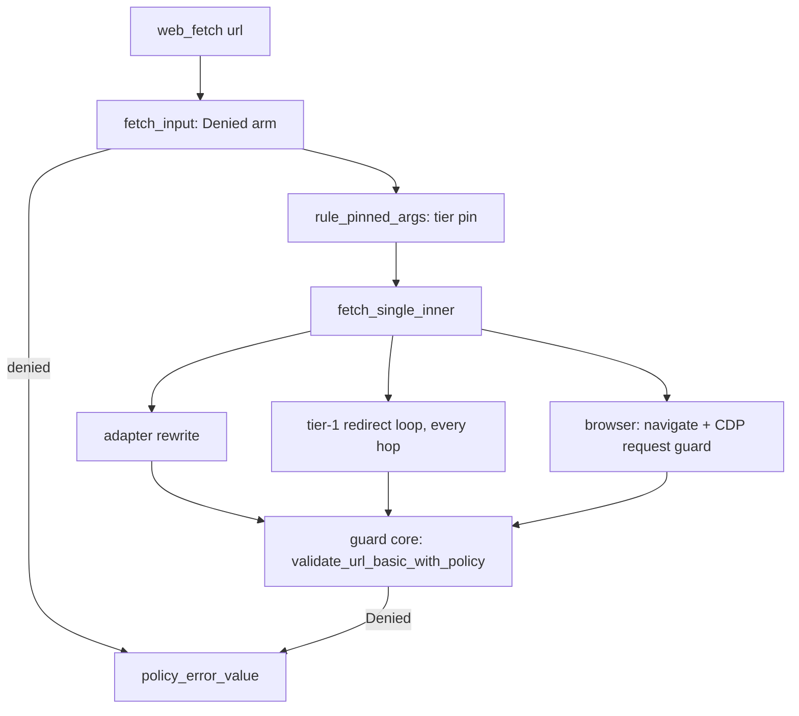
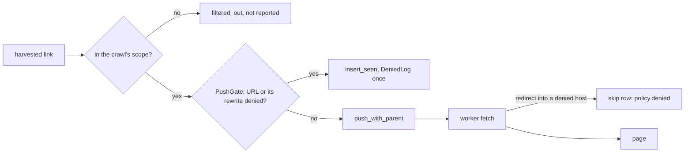

# Local rules: architecture

For whoever maintains or extends the rules code. What rules do for an
operator is in [rules.md](rules.md); this page is how they are built, which
decisions hold the design together, and what was left for later.

## The pieces

| piece | where | job |
| --- | --- | --- |
| config types | `src/rules.rs` (`RulesSection`, `UrlRule`) | `[rules]` and `[rules.url."<pattern>"]`, deserialized with `deny_unknown_fields` |
| compiler | `RuleSet::compile` | pure; every load error comes from here |
| matcher | `RuleSet::eval`, `matches`, `denial` | pure; normalizes the URL, picks one winner |
| process ruleset | `rules()` | `OnceLock`, filled from `cfg().rules`; empty when `mode = "off"` |
| the refusal | `FetchError::Denied` (`src/error.rs`) | self-contained payload: rule key, message, kind, reason |
| guard core | `validate_url_basic_with_policy` (`src/fetch/guards.rs`) | where `Denied` is produced |
| formatter | `policy_error_value` (`src/mcp/server/errors.rs`) | the one place a denial becomes a tool result |

Config plumbing is in `src/config.rs`: `validate()` calls `RuleSet::compile`,
the two `[rules]` scalars are ordinary fieldbook knobs, every other
`DONSETCH_RULES*` env name is a hard error, and `Loaded::origin_of_path`
reads a leaf's layer at any depth (the rule table itself is not in the
fieldbook, so `config show` lists only the scalars).

## Matching

Keys are a host, `.host` (exact) or `scheme://` plus either. A key must
already be in normal form, because the config crate merges keys byte-exact:
two spellings of one pattern would become two rules, and an intended
override would silently become a second rule. So `compile` rejects instead
of normalizing, and its error names the spelling to write. Duplicate
detection runs on the compiled form, as a backstop for any gap in those
checks.

The URL side is normalized once, inside `eval`: the host from `url::Url`
(already lowercase and punycode) with every trailing dot stripped. `rules
test` and every guard see the same form.

Precedence is winner-takes-all, never a per-field cascade: more host labels
beat fewer, the exact form beats the tree at the same host, one scheme beats
both, then the key string as a tie-break. `enabled = false` removes a rule
from the candidates. A cascade was rejected because it needs every field to
stay optional through the merge, and a missed "absent vs default" turns into
a silent `action = "allow"` override. The cost of winner-takes-all is
documented for operators: a narrow tier-only rule cancels a broader deny.

The index is an exact-host map plus a tree map looked up once per suffix of
the URL's host, so a lookup is a few hash probes, not a scan.

## Where the check runs

Two levels, because no single site sees both the caller's URL and every
redirect and rewrite:

1. **Primary**: `web_fetch`'s `fetch_input` guard check. It runs first in
   `fetch_single`, before persona and lane setup and before every cache
   (search prewarm, render cache, unlocker cache), and again on each
   fallback re-entry. It must match `Denied` before its `guard.ssrf` arm,
   because an explicit code outranks the text classifier.
2. **Backstop**: the guard core that both `validate_url_basic` and
   `ensure_url_safe` call. That one place covers the tier-1 redirect loop
   (`validate_redirect_url` on every hop), adapter rewrites, the browser
   lane's navigation checks and its CDP request guard, search's engine
   queries and prefetch, and doctor. The rule check sits after the
   scheme, credential and host checks and before the SSRF check, so a deny
   holds even with `fetch.allow_private_egress`.

The guard core only refuses. A tier pin needs its own lookup:
`rule_pinned_args` in `fetch_single` evaluates the caller's URL once and
hands `fetch_single_inner` a clone of the arguments with `tier` replaced, so
a rule's tier is indistinguishable from a tier the caller passed (adapter
rewrite gate and routing included). Fallbacks inherit that pin and are not
re-evaluated. `rule_tier` holds the precedence table.

## The error contract

- **Self-contained variant.** `Denied` carries the rule's payload instead of
  a key to look up, so formatting never depends on the process-global
  ruleset, and a unit test can build and assert one.
- **`Display` prints fixed text only**: `blocked by a local DonSeTch rule`,
  with neither the key nor the message. A stringified error feeds text
  heuristics (`error_code`'s substring classifier, `lane_note`), and
  operator text there would misfire: a message mentioning "timeout" coded
  `network.timeout`, a key like `connect.example` read as a dead proxy lane.
  Adding the key back reopens that.
- **Every routing site calls `policy_error_value`** before the error turns
  into text: `fetch_input`, the rewritten-URL guard, the tier-1 `Err` arm
  (above its adapter branch), `fetch_with_actions`, `ghost_escalate` (which
  returns `GhostFailure::Denied` so a denial never reaches the
  `kind == "walled"` → paid unlocker gate), `web_screenshot`'s four sites,
  and the crawl's seed guard. A missed site degrades rather than lies:
  `error_code` has a first arm on the fixed text that yields
  `policy.denied.unspecified`.
- **Codes have three segments**, `policy.denied.<reason>`, with
  `unspecified` as the filler, so consumers can split and read segment 3.
  The operator picks the subcode, never the code.
- **The rule's `kind` becomes `errorKind`**, which drives the CLI exit code
  and `read_status`. `tool_error_structured` sets `ok: false`; build through
  it, never by hand.
- **Catch-all sites that would be silently wrong** got explicit arms:
  `fetch_error_kind`, `fetch_error_code` (now `Option<Cow<str>>`),
  `lane_note` (no lane verdict), ghost probe stats (no failure class; the
  probe re-arms its cadence), search engine outcome (`invalid-config:`, so
  the engine is not quarantined), and the search prefetch (the bot-wall
  shape: score untouched, no quality recorded).

The non-http(s) redirect, which the redirect loop used to recognize by a
`non-http` substring, is now its own variant, `NonHttpRedirect`, so no
`Denied` text can be mistaken for it.

## The crawl

- **Push time, not dequeue time.** `PushGate` tests every candidate and its
  adapter rewrite before it enters the frontier. A denied URL never takes a
  queue slot or a `max_pages` unit, and is reported even when the crawl
  stops early. Its key goes into `seen` through `insert_seen`, which never
  touches the heap (`mark_seen` would delete a queued entry), so it is
  recorded once however many pages link it.
- **Rules before robots.** A refused robots.txt reads as "unreachable,
  disallow-all" (#351), so robots first would cache a denied origin as
  disallowed and report it as a robots exclusion. `RobotsCache::ensure`
  refuses to fetch for a denied origin and leaves it unknown.
- **Two sinks, kept apart.** URLs refused at push time go to `DeniedLog`
  (grouped by rule, capped per rule, saved in the resume token). A URL that
  was dialled and then redirected into a denied host is a skip row,
  `policy_skip_reason`, because it was fetched. The crawl fetcher carries
  the denial on `FetchedPage.denied` instead of flattening it to a network
  error, so the worker neither retries it nor slows the host's pacing.
- **Output.** `crawl_tool` renders the counter line and trailing section;
  `compat::shape_result` keeps only the count in `[meta]` for the markdown
  modes and the groups (without rule keys) in dataset mode. `crawl_complete`
  and `compute_crawl_next_action` test the `policy.denied.` prefix before
  their substring checks, since an operator's key can contain `wall` or
  `404`.
- **A failed seed with nothing else to fetch is a hard error**, judged when
  the result is assembled (`SeedFailure`), not before the workers run,
  because retries and the browser hook rescue seeds today. Its code follows
  `web_fetch` per cause. Resumed seeds are guarded at the tool entry through
  `resume_store_peek`, which reads the token without consuming it.

## Testing

Compile, match and `validate_url_basic_with_policy` tests take a locally
compiled `RuleSet` and run on any runner. Anything that reads `rules()`
through the public guards, the fetch surface or the crawl needs an installed
config, which is once per process, so those tests depend on nextest and say
so in a comment. The crawl tests use `Crawler::with_rules` to stay pure.

## Decisions not to reopen

- Rules ship empty: DonSeTch carries no site list.
- A map keyed by pattern, not an array: arrays replace across layers, tables
  merge per key. `enabled = false` is the tombstone, because the config
  crate has no unset.
- Bad rules are hard load errors: for a policy table, "skip with a warning"
  means running without a protection the operator believes is on.
- No catch-all key: donsetch's own engine and doctor traffic passes the same
  guard, so "deny everything" would switch off search.
- `--ignore-rules` is CLI-only, and MCP fails closed on an unknown argument.
  Rules are a guardrail, not a security boundary.
- Search results are never dropped or reordered by a rule.
- `kind` is `walled` or `permanent` only: `transient` would invite an
  endless retry against a policy that never changes.

## Known gaps, accepted for v1

- A redirect the browser follows into a denied host is stopped by the CDP
  guard but surfaces as a browser navigation error, not `policy.denied`; the
  crawl's browser hook reports it as text (`GhostHook` returns a `String`).
- The paid unlocker can return a denied host's page after a redirect on its
  side; the request never leaves from the operator's IP.
- A rule refusing a phase-1 robots or sitemap fetch is silent: discovery
  shrinks with nothing reported.
- A link already outside the crawl's scope is dropped by the scope check
  before the rules check and is not reported.

## Future ideas

Each is additive: no v1 key or output changes meaning when it arrives.

- **Path patterns.** v1 rejects every key with a path, `?`, `#` or port, so a
  path grammar can come later without changing a v1 key. It is a one-way
  door: pick one widely used format deliberately. A rule without a path
  counts as "every path", the least specific, so precedence gains one step
  between host and scheme.
- **Explicit ports.** An optional `:port`; compare
  `port_or_known_default()`, since `url` drops a default port.
- **`glob:` and `re:` keys.** Reserved now (load errors), for whole-URL
  globs and regexes.
- **Annotating search results.** Mark a hit whose host is denied so the
  agent does not spend a fetch on it, keeping the URL verbatim (it carries
  the title, authors and often a DOI). Open points: per-line marker or
  footer, token cost, whether a marked hit uses a result slot. Crawl map
  mode, which lists URLs without fetching them, should get the same answer.
- **Letting a deny demote search hits.** A per-rule knob; v1 deliberately
  keeps ranking untouched.
- **`warn` rules.** Fetch, but tell the agent; including warnings for
  intermediate redirect hops. Needs a delivery contract the agent reads.
- **Rules on document requests only, in the browser.** Today the CDP guard
  blocks every request to a denied host, images and scripts on allowed
  pages included. `Fetch.requestPaused` carries `resourceType`, so the rule
  half of the guard could skip subresources while the SSRF half keeps
  applying to everything. Revisit if a deny breaks pages nobody named.
- **Typed browser denials.** Store the `Denied` the CDP guard saw for a
  document request in a per-tab slot that navigation returns, so a
  browser-followed redirect reports the rule; then type `GhostHook`'s error
  so the crawl keeps it.
- **A second config file layer** (project-level). The map shape already
  merges per key. Then the duplicate-key error should name each key's layer
  (`Loaded::origin_of_path` exists for it), and `tier = "auto"` becomes the
  way to cancel a lower layer's pin.
- **A denial sink before the page loop**, so a rule that blocks a robots or
  sitemap fetch is reported instead of silently shrinking discovery.
